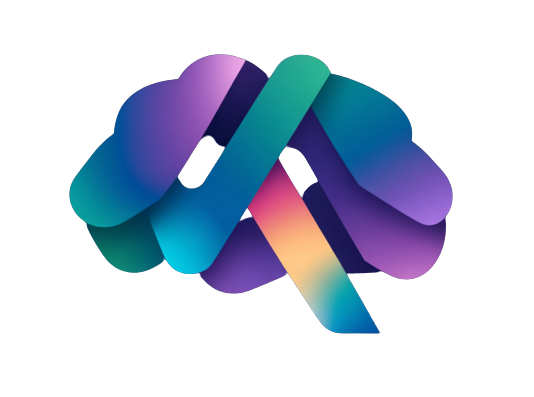
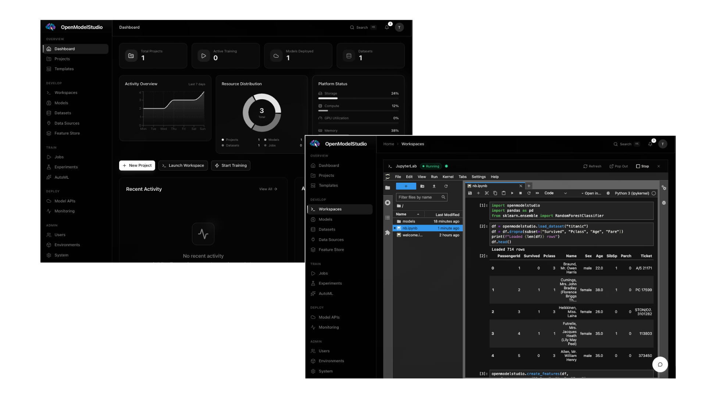
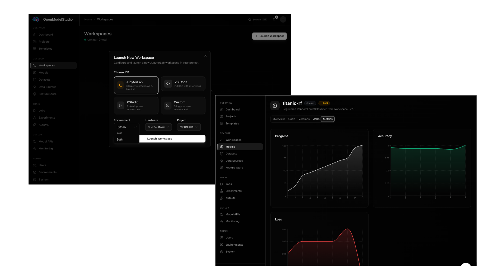

<p align="center">
  
</p>

<h1 align="center">OpenModelStudio</h1>

<p align="center">
  An open-source AI laboratory for building, training, and deploying machine learning models.<br/>
  Powered by Kubernetes.
</p>

| Status | Badge | Status | Badge |
| --- | --- | --- | --- |
| `Build` | [](https://github.com/GACWR/OpenModelStudio/actions) | `Docker` | [](https://github.com/GACWR/OpenModelStudio/actions) |
| `License` | [](https://github.com/GACWR/OpenModelStudio/blob/main/LICENSE) | `Platform` |  |
| `Issues` | [](https://github.com/GACWR/OpenModelStudio/issues) | `Closed Issues` | [](https://github.com/GACWR/OpenModelStudio/issues?q=is%3Aissue+is%3Aclosed) |
| `Pull Requests` | [](https://github.com/GACWR/OpenModelStudio/pulls) | `Last Commit` | [](https://github.com/GACWR/OpenModelStudio/commits/main) |
| `Top Language` | [](https://github.com/GACWR/OpenModelStudio) | `Code Size` | [](https://github.com/GACWR/OpenModelStudio) |
| `Repo Size` | [](https://github.com/GACWR/OpenModelStudio) | `Contributors` | [](https://github.com/GACWR/OpenModelStudio/graphs/contributors) |
| `Stars` | [](https://github.com/GACWR/OpenModelStudio/stargazers) | `Forks` | [](https://github.com/GACWR/OpenModelStudio/network/members) |
| `Rust` |  | `Axum` |  |
| `Next.js` |  | `React` |  |
| `TypeScript` |  | `Python` |  |
| `PostgreSQL` |  | `Kubernetes` |  |
| `PyTorch` |  | `Docker` |  |
| `shadcn/ui` |  | `GraphQL` |  |
| `Playwright` |  | `PRs Welcome` | [](https://github.com/GACWR/OpenModelStudio/pulls) |
| `Discord` | [](https://discord.gg/kCwDRnvpMt) | | |

<p align="center">
  
</p>

---

## Features

### For Data Scientists
- **Project Management** -- Organize experiments with stage-based workflow (Ideation, Development, Production)
- **Model Editor** -- Write and edit models directly in the browser with Monaco (Python + Rust)
- **Real-Time Training** -- Watch loss curves update live via SSE during training
- **Generative Output Viewer** -- See video/image/audio outputs as models train
- **Experiment Tracking** -- Compare runs with parallel coordinates and sortable tables
- **JupyterLab Workspaces** -- Launch cloud-native notebooks with one click
- **LLM Assistant** -- Natural language control of the entire platform
- **AutoML** -- Automated hyperparameter search
- **Feature Store** -- Reusable features across projects

### For ML Engineers
- **Kubernetes-Native** -- Every model trains in its own ephemeral pod
- **Rust API** -- High-performance backend built with Axum + SQLx
- **GraphQL** -- Auto-generated from PostgreSQL via PostGraphile
- **Streaming Data** -- Never load full datasets to disk
- **One-Command Deploy** -- `make k8s-deploy` sets up everything

### For Researchers
- **HARPA Architecture** -- Novel hierarchical adaptive recurrent model included
- **Genie World Model** -- Interactive video generation from unlabeled video
- **Video-JEPA** -- Self-supervised video representation learning
- **TRM** -- Tiny recursive reasoning model (7M params, recursion-as-depth)
- **Video Generation Pipeline** -- End-to-end video+audio dataset processing
- **PyTorch + Rust-Torch** -- Write models in either language
- **Consumer Hardware** -- Designed to train on laptops, not GPU clusters

---

<p align="center">
  
</p>

## Quick Start

### Prerequisites

| Tool | Version |
|------|---------|
| Docker | Latest |
| Kind | 0.20+ |
| Rust | 1.93+ |
| Node.js | 22+ |
| pnpm | 9+ |

### One-Command Setup

```bash
make k8s-deploy
```

This will:
1. Tear down any existing cluster (clean slate)
2. Build all Docker images (API, Frontend, PostGraphile, Model Runners)
3. Create a Kind cluster
4. Deploy PostgreSQL, API, Frontend, PostGraphile, JupyterHub
5. Run database schema and seed data
6. Health check all services

### Access

| Service | URL |
|---------|-----|
| **Frontend** | http://localhost:31000 |
| **API** | http://localhost:31001 |
| **GraphQL Playground** | http://localhost:31002/graphql |
| **JupyterHub** | http://localhost:31003 |

### Default Credentials

| Role | Email | Password |
|------|-------|----------|
| Admin | `test@openmodel.studio` | `Test1234` |

---

## Architecture

```
                          Kind Cluster

  +-----------+  +----------+  +-------------+  +------------+
  | Frontend  |  | Rust API |  | PostGraphile|  | JupyterHub |
  | Next.js   |  |  Axum    |  |  GraphQL    |  |            |
  | :31000    |  |  :31001  |  |  :31002     |  |  :31003    |
  +-----+-----+  +----+-----+  +------+------+  +------+-----+
        |              |               |                |
        |         +----+---------------+----+           |
        |         |     PostgreSQL 16       |           |
        |         |       :5432             |           |
        |         +-------------------------+           |
        |              |                                |
        |         +----+-----------+                    |
        |         | Model Runner   |   +------------+   |
        |         | Pods (ephemeral|   | User        |   |
        |         | - Python       |   | Notebook    |   |
        |         | - Rust         |   | Pods        |   |
        |         +----------------+   +------------+   |
```

### Components

| Component | Stack | Description |
|-----------|-------|-------------|
| **Frontend** | Next.js 16, shadcn/ui, Tailwind, Recharts | App Router, Monaco editor, SSE streaming, Cmd+K search |
| **API** | Rust, Axum, SQLx | JWT auth, RBAC, K8s client, SSE metrics, LLM integration |
| **PostGraphile** | Node.js | Auto-generated GraphQL from PostgreSQL schema |
| **PostgreSQL 16** | SQL | Primary data store: users, projects, models, jobs, datasets, experiments |
| **Model Runner** | Python/Rust | Ephemeral K8s pods per training job, streaming metrics |
| **JupyterHub** | Python | Per-user JupyterLab with pre-configured SDK and datasets |

### Training Job Lifecycle

```
User clicks "Train" --> API creates training_job record
                    --> API creates K8s Job with model code + config
                    --> Pod starts, loads data via streaming
                    --> Pod reports metrics via HTTP --> API stores + relays via SSE
                    --> Frontend receives SSE --> Updates charts in real-time
                    --> Pod completes --> Saves model artifacts
                    --> API updates training_job status --> Frontend shows results
```

### Database Schema (Key Tables)

```sql
users           (id, email, name, password_hash, role, created_at)
projects        (id, name, description, stage, owner_id, created_at)
models          (id, project_id, name, framework, created_at)
model_versions  (id, model_id, version, code, created_at)
jobs            (id, project_id, model_id, job_type, status, config, metrics, started_at, completed_at)
datasets        (id, project_id, name, path, format, size_bytes, created_at)
experiments     (id, project_id, name, description, created_at)
experiment_runs (id, experiment_id, parameters, metrics, created_at)
workspaces      (id, user_id, status, jupyter_url, created_at)
```

> See [docs/ARCHITECTURE.md](docs/ARCHITECTURE.md) for the full architecture documentation.

---

## Tutorial

Follow these guides to go from zero to a fully tracked ML experiment:

1. **[Usage Guide](docs/USAGE.md)** -- Log in, create a project, upload a dataset, launch a workspace
2. **[Modeling Guide](docs/MODELING.md)** -- Train, evaluate, and track models using the SDK (13-cell notebook walkthrough)

---

## REST API Reference

### Authentication

| Method | Endpoint | Description |
|--------|----------|-------------|
| `POST` | `/auth/register` | Register a new user |
| `POST` | `/auth/login` | Login and receive JWT |
| `GET` | `/auth/me` | Get current user profile |

### Projects

| Method | Endpoint | Description |
|--------|----------|-------------|
| `GET` | `/projects` | List all projects |
| `POST` | `/projects` | Create a project |
| `GET` | `/projects/:id` | Get project details |
| `PUT` | `/projects/:id` | Update project |
| `DELETE` | `/projects/:id` | Delete project |

### Models

| Method | Endpoint | Description |
|--------|----------|-------------|
| `GET` | `/models` | List models |
| `POST` | `/models` | Create a model |
| `PUT` | `/models/:id/code` | Update model source code |
| `POST` | `/models/:id/run` | Execute model |

### Training

| Method | Endpoint | Description |
|--------|----------|-------------|
| `POST` | `/training/start` | Start a training job |
| `GET` | `/training/:id` | Get training job status |
| `GET` | `/training/:id/metrics` | SSE stream of training metrics |

### Other Endpoints

| Method | Endpoint | Description |
|--------|----------|-------------|
| `POST` | `/workspaces/launch` | Launch a JupyterLab workspace |
| `DELETE` | `/workspaces/:id` | Stop a workspace |
| `POST` | `/llm/chat` | Chat with LLM assistant (SSE) |
| `GET` | `/datasets` | List datasets |
| `POST` | `/datasets` | Upload a dataset |
| `POST` | `/experiments` | Create an experiment |
| `GET` | `/experiments/:id/runs` | Get experiment runs |

### GraphQL (port 31002)

Auto-generated from PostgreSQL schema via PostGraphile. Explore at [`/graphiql`](http://localhost:31002/graphiql).

---

## Environment Variables

| Variable | Required | Description |
|----------|----------|-------------|
| `DATABASE_URL` | Yes | PostgreSQL connection string |
| `JWT_SECRET` | Yes | Secret for JWT signing |
| `JWT_REFRESH_SECRET` | Yes | Secret for refresh token signing |
| `RUST_LOG` | No | Log level (default: `info`) |
| `LLM_PROVIDER` | No | LLM provider: `ollama`, `openai`, or `anthropic` (default: `ollama`) |
| `LLM_API_KEY` | No | API key for the configured LLM provider |
| `LLM_MODEL` | No | Model name for the LLM provider (default: `llama2`) |
| `LLM_BASE_URL` | No | Base URL for LLM API (default: `http://localhost:11434`) |
| `S3_BUCKET` | No | For dataset/artifact storage (default: `openmodelstudio`) |
| `S3_REGION` | No | S3 region (default: `us-east-1`) |
| `K8S_NAMESPACE` | No | Kubernetes namespace (default: `openmodelstudio`) |

---

## Development

### Local Development

```bash
make dev           # Starts Postgres via Docker, prints instructions for API + Frontend
make dev-api       # Run Rust API locally on :8080
make dev-frontend  # Run Next.js frontend locally on :3000
```

### Run Tests

```bash
make test          # API + Frontend tests
make test-api      # Rust API tests only
make test-e2e      # Playwright E2E tests
make test-all      # Everything (unit + e2e + models + pipelines)
```

### Makefile Targets

Run `make help` to see all available targets. Key ones:

| Target | Description |
|--------|-------------|
| `make k8s-deploy` | Full K8s deployment (Kind + all services) |
| `make k8s-teardown` | Destroy Kind cluster and all resources |
| `make k8s-redeploy` | Rebuild + redeploy to existing cluster |
| `make k8s-restart-api` | Rebuild and restart just the API pod |
| `make k8s-restart-frontend` | Rebuild and restart just the Frontend pod |
| `make k8s-status` | Show pod/service/PVC status |
| `make k8s-logs` | Tail all pod logs |
| `make k8s-psql` | Open a psql shell to K8s Postgres |
| `make dev` | Local development mode |
| `make test` | Run all tests |
| `make lint` | Lint everything (Rust + TypeScript) |
| `make doctor` | Check all prerequisites are installed |
| `make clean` | Clean build artifacts |

---

## Documentation

| Doc | Description |
|-----|-------------|
| [Usage Guide](docs/USAGE.md) | UI walkthrough: login, projects, datasets, workspaces |
| [Modeling Guide](docs/MODELING.md) | End-to-end SDK notebook: train, evaluate, track |
| [Architecture](docs/ARCHITECTURE.md) | System design, component diagram, data flow |
| [Model Authoring](docs/MODEL-AUTHORING.md) | How to write models for OpenModelStudio |
| [Dataset Guide](docs/DATASET-GUIDE.md) | Preparing and uploading datasets |
| [Deployment](docs/DEPLOYMENT.md) | Production deployment guide |
| [LLM Integration](docs/LLM-INTEGRATION.md) | LLM assistant architecture and extending |
| [Research Models](docs/RESEARCH_MODELS.md) | Research architectures: HARPA, Genie, JEPA |
| [Contributing](docs/CONTRIBUTING.md) | How to contribute |

---

## Contributing

We welcome contributions! See [CONTRIBUTING.md](docs/CONTRIBUTING.md) for guidelines.

---

## License

[GPL License](https://github.com/GACWR/OpenModelStudio/blob/main/LICENSE)
